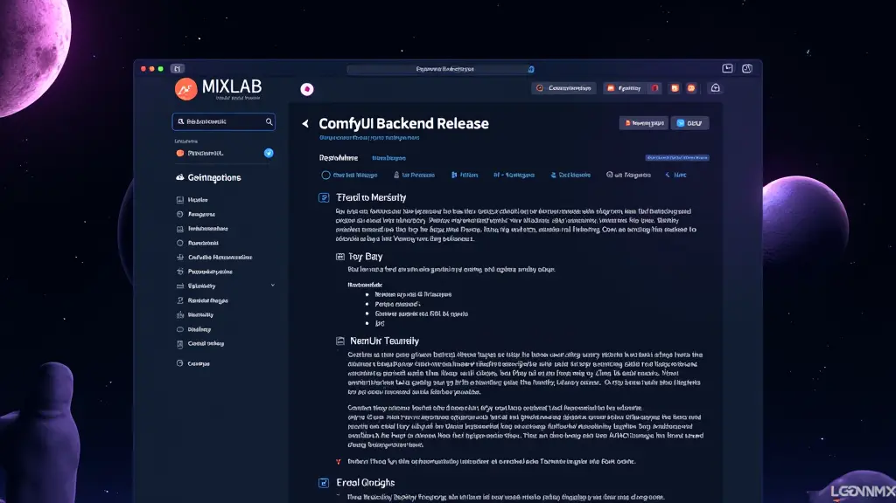

# ComfyUI Backend Release / ComfyUI 后端

商务合作请联系 389570357@qq.com  
For business cooperation, please contact email 389570357@qq.com

## Introduction / 介绍

This repository provides a backend release for ComfyUI with built-in plugins and additional configurations.  
这个仓库提供了一个带有内置插件和额外配置的ComfyUI后端。

### Features / 特点

1. 内置常用插件 **Built-in Plugins Package**: [ComfyUI-Backend-MixlabNodes](https://github.com/shadowcz007/ComfyUI-Backend-MixlabNodes)  
   **内置插件的ComfyUI包**：[ComfyUI-Backend-MixlabNodes](https://github.com/shadowcz007/ComfyUI-Backend-MixlabNodes)


2. Python环境支持修改 

基于官方的[2.3.1+cu121 v0.0.1 环境 Python 3.11.8](https://github.com/comfyanonymous/ComfyUI/releases/download/v0.0.1/ComfyUI_windows_portable_nvidia.7z)。**Python环境包**：解压后把后缀版本号去掉，放到内置插件的ComfyUI包里，链接：[下载链接](https://pan.baidu.com/s/1hRUGxwNaPK-d3MOpCNF_pw?pwd=MAI0 )

Python环境位置修改：将Python环境路径写入 `config/python_path.txt`。


**Python Environment Package**: Extract, remove the version suffix, and place it in the built-in plugins package. [Download Link](https://pan.baidu.com/s/1hRUGxwNaPK-d3MOpCNF_pw?pwd=MAI0 )  

Based on the official [2.3.1+cu121 v0.0.1 Environment Python 3.11.8](https://github.com/comfyanonymous/ComfyUI/releases/download/v0.0.1/ComfyUI_windows_portable_nvidia.7z).

 Python Environment Location ：Write the Python environment path to `config/python_path.txt`.  


3. 模型位置支持修改 **Modify the model paths in `config/extra_model_paths.yaml`**  
   **修改 `config/extra_model_paths.yaml` 里的模型地址**
   
You can modify the `base_path` in `extra_model_paths.yaml`.  
可以修改 `extra_model_paths.yaml` 的 `base_path`。

针对部分插件的模型路径，进行了统一

   Modify the auxiliary model path to match ComfyUI's unified configuration method:  
   修改辅助模型路径为ComfyUI的统一配置方式：

    * `custom_nodes/comfyui_controlnet_aux/utils.py`
    
    ```python
    # Use ComfyUI's directory structure / 使用comfyui的目录结构
    annotator_ckpts_path = folder_paths.get_folder_paths('controlnet_ckpts')[0]
    ```

 For IPA using insightface, add code to prioritize the configured path:  
   当IPA使用insightface时，添加代码优先使用配置的路径：

    ```python
    def get_model_dir(m):
        try:
            return folder_paths.get_folder_paths(m)[0]
        except:
            return os.path.join(folder_paths.models_dir, m)
    ```

ComfyUI-Reactor-Node: Modify the model path to use the configured path:  
   ComfyUI-Reactor-Node：修改模型路径为配置的路径：

    ```python
    glob.glob(models_path)
    models_path needs to be: / models_path 需要是：
    models_path = os.path.join(FACE_MODELS_PATH, "*")
    ```
    

## 依赖库预先内置

## Accelerate Inference Speed / 加速推理速度

[Flash-attn Installation Method](https://t.zsxq.com/CMcRp)  
[Flash-attn 安装方法](https://t.zsxq.com/CMcRp)

[Flash-attn Download](https://github.com/bdashore3/flash-attention/releases/download/v2.6.3/flash_attn-2.6.3+cu123torch2.3.1cxx11abiFALSE-cp311-cp311-win_amd64.whl)  

[Flash-attn 下载](https://github.com/bdashore3/flash-attention/releases/download/v2.6.3/flash_attn-2.6.3+cu123torch2.3.1cxx11abiFALSE-cp311-cp311-win_amd64.whl)


## macOS Installation / macOS 安装指南

1. Ensure Python version is 3.11 and Torch version is 2.1.2.  
   确保Python版本为3.11，Torch版本为2.1.2。

2. After installation, grant permissions with `chmod +x run_mac.sh`.  
   安装完成后，使用 `chmod +x run_mac.sh` 授权。

3. Run `./run_mac.sh`.  
   运行 `./run_mac.sh`。


## License / 许可证

This project is licensed under the MIT License.  
这个项目使用MIT许可证。