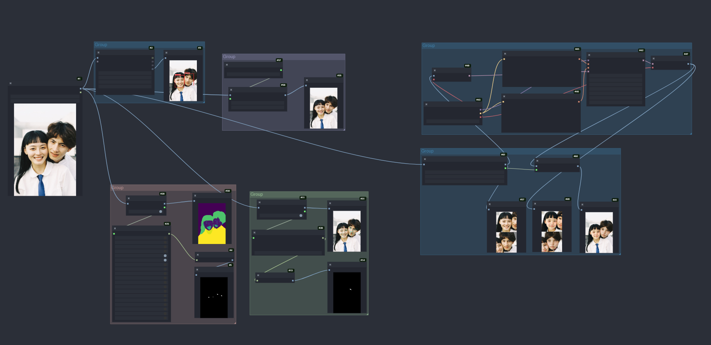

# comfyui-face-pro
> [Mixlab nodes discord](https://discord.gg/cXs9vZSqeK)





### example
[crop-face-and-paste](./example/crop-face-workflow.json)

[all](./example/face-pro-workflow.json)


### install
```bash
install.bat
```

### model
1 Face parsing model
put to "models/face_parsing/" folder.

[face parsing model](https://huggingface.co/jonathandinu/face-parsing/tree/main)

2 Face Restoration Models
put to "models/facerestore/"

[GFPGANv1.4.pth](https://github.com/TencentARC/GFPGAN/releases/download/v1.3.4/GFPGANv1.4.pth)
[codeformer.pth](https://github.com/sczhou/CodeFormer/releases/download/v0.1.0/codeformer.pth)

3 Face detection models
put to "models/facedetection/"

[detection_Resnet50_Final.pth](https://github.com/xinntao/facexlib/releases/download/v0.1.0/detection_Resnet50_Final.pth) 
[detection_mobilenet0.25_Final.pth](https://github.com/xinntao/facexlib/releases/download/v0.1.0/detection_mobilenet0.25_Final.pth)
[parsing_parsenet.pth](https://github.com/sczhou/CodeFormer/releases/download/v0.1.0/parsing_parsenet.pth)


### Q&A

ImportError: cannot import name 'get_device' from 'basicsr.utils.misc' (./lib/python3.10/site-packages/basicsr/utils/misc.py)

如果系统里已经装了basicsr 1.4.2，可以把CodeFormer里的basicsr/utils/misc.py 覆盖到系统里的作为替换。
（感谢@Liguo的反馈）


#### Credits
mav-rik[/facerestore_cf](https://github.com/mav-rik/facerestore_cf)
Ryuukeisyou[/comfyui_face_parsing](https://github.com/Ryuukeisyou/comfyui_face_parsing) 
discopixel-studio[/comfyui-discopixel](https://github.com/discopixel-studio/comfyui-discopixel)