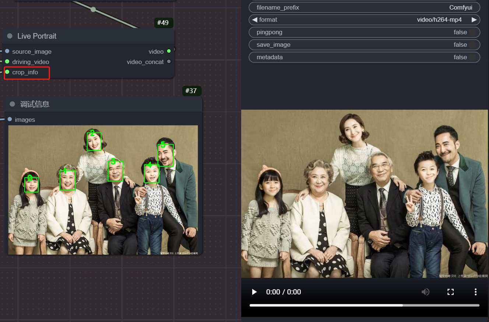
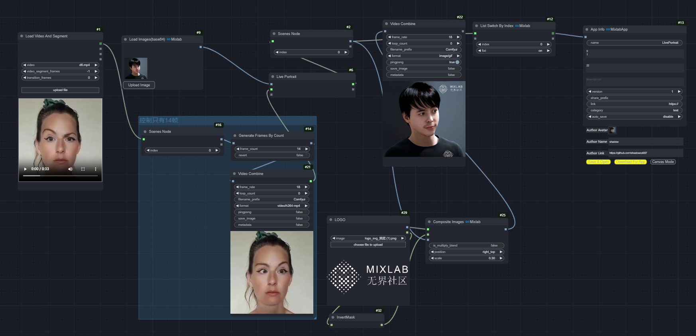

[LivePortrait](https://github.com/KwaiVGI/LivePortrait)的Comfyui版本。


### workflow
> 配合 [comfyui-mixlab-nodes](https://github.com/shadowcz007/comfyui-mixlab-nodes) 使用

> 全家福

[](example/全家福模式-workflow.json)

[Workflow JSON](example/全家福模式-workflow.json)


[](example/live_workflow.json)

[Workflow JSON](example/live_workflow.json)

[AppInfo workflow JSON](example/appinfo-workflow.json)

### Nodes

这个ComfyUI节点名为“Live Portrait”，用于生成动态肖像。

输入参数：
source_image：输入一张静态图像，作为生成动态肖像的基础。
driving_video：输入一个驱动视频，决定动态肖像的动作和表情变化。
crop_info：输入人脸裁剪信息，用于指定人脸的裁剪区域。

输出：
video：输出生成的动态肖像视频。
video_concat：输出与驱动视频合成后的动态肖像视频（如果有的话）。


### models

[google drive](https://drive.google.com/drive/folders/1UtKgzKjFAOmZkhNK-OYT0caJ_w2XAnib)

[百度](https://pan.baidu.com/s/1WpZ1FrqYLLytvLBIpTWShw?pwd=MAI0)

放置到 

``` Comfyui/models/liveportrait ``` 

``` Comfyui/models/insightface ```

### python环境依赖

[打包好的环境](https://pan.baidu.com/s/1oQCvtWR2seFloZDGsNGNTQ?pwd=MAI0)

如果安装了 [comfyui-mixlab-nodes](https://github.com/shadowcz007/comfyui-mixlab-nodes) ，是不需要再安装新的依赖的。


#### 相关插件推荐

[Comfyui-ChatTTS](https://github.com/shadowcz007/Comfyui-ChatTTS)

[comfyui-sound-lab](https://github.com/shadowcz007/comfyui-sound-lab)

[comfyui-Image-reward](https://github.com/shadowcz007/comfyui-Image-reward)

[comfyui-ultralytics-yolo](https://github.com/shadowcz007/comfyui-ultralytics-yolo)

[comfyui-moondream](https://github.com/shadowcz007/comfyui-moondream)

